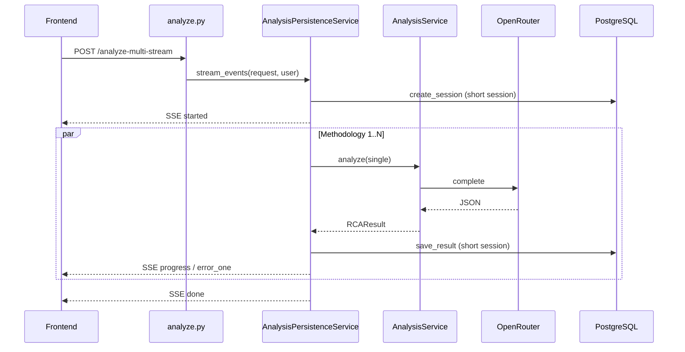

# refactoring-plan-sse-db.md — План рефакторинга: SSE multi-analysis и слой БД

> **Дата:** 2026-06-15  
> **Блок:** `POST /api/v1/analyze-multi-stream`, транзакции repository, персистенция в API vs services.  
> **Связано:** [code-quality-audit.md](code-quality-audit.md) §3–5, [architecture.md](architecture.md) §3.

---

## 1. Контекст проблемы

Multi-analysis через SSE — самый долгий и нагруженный сценарий:

```text
POST /analyze-multi-stream
  → создать analysis_session
  → N параллельных LLM-вызовов (до ~120 с каждый)
  → save_result × N (embedding + pgvector)
  → SSE: started → progress/error_one → done
```

**Исходные проблемы (до P0):**

1. **Долгоживущая `AsyncSession`** — сессия из `Depends(get_db)` удерживалась на всё время LLM-фазы → при `pool_size=5` несколько параллельных сравнений истощали пул.
2. **Рассинхрон UI и БД** — при ошибке `save_result` результат всё равно попадал в `results` и событие `done`.
3. **Утечка деталей** — `error_one` отдавал `str(exc)` клиенту.
4. **Двойной commit** — `repository.save_result()` коммитит внутри, роут дополнительно вызывает `db.commit()`.
5. **Персистенция в API-слое** — `analyze.py` напрямую вызывает `RCARepository`, минуя `AnalysisService`.

---

## 2. Что сделано в P0 (15.06.2026)

### 2.1. Короткоживущие DB-сессии в SSE

`analyze_multi_stream` больше не использует `Depends(get_db)`:

| Фаза | DB-сессия | Действие |
|------|-----------|----------|
| Старт | `async with AsyncSessionLocal()` | `create_session` → `commit` → закрытие |
| LLM (N задач) | **нет** | только `_service.analyze()` |
| Сохранение каждой методики | новая `AsyncSessionLocal()` | `save_result` (commit внутри repo) |

Файл: `src/api/routes/analyze.py`, функция `analyze_multi_stream`.

### 2.2. Корректная обработка ошибки сохранения

- При `save_result` exception → событие `error_one`, результат **не** добавляется в `results`.
- Событие `done` содержит только успешно сохранённые результаты.
- Если все методики провалились (LLM или save) → событие `error`.

### 2.3. Санитизация сообщений `error_one`

Клиенту отдаются обобщённые сообщения, без `str(exc)`:

- LLM/анализ: `"Ошибка анализа методики"`
- Сохранение: `"Не удалось сохранить результат в базе данных"`

### 2.4. Runners: `incident_id`

Константа `UNASSIGNED_INCIDENT_ID` в `base.py`; финальный UUID назначает API (`analyze.py`) или `AnalysisService.analyze_multi()`.

### 2.5. Тесты

- `tests/unit/test_five_why.py` — `incident_id` не зависит от `incident_date`
- `tests/api/test_analyze_multi_stream.py` — happy-path SSE, save failure → `error_one`

---

## 3. Целевая архитектура (фазы P1–P2)

### 3.1. Фаза A — Use-case слой персистенции (P1, ~3–5 дней)

**Цель:** убрать `RCARepository` из `analyze.py`; API только маршрутизирует HTTP.

```text
analyze.py
  → AnalysisPersistenceService (новый)
      → AnalysisService.analyze() / analyze_multi()
      → RCARepository (короткие сессии)
      → возврат RCAResult / list[RCAResult]
```

**Шаги:**

1. Создать `src/services/analysis_persistence_service.py`:
   - `async def run_single(request, user_id) -> RCAResult`
   - `async def run_multi(request, user_id) -> list[RCAResult]`
   - `async def run_multi_stream_events(request, user_id) -> AsyncIterator[str]` (SSE payload)
2. Внутри — фабрика сессий `_with_db()`:
   ```python
   @asynccontextmanager
   async def _with_db():
       async with AsyncSessionLocal() as session:
           yield session
   ```
3. Перенести `_incident_to_session_kwargs` в persistence service или `src/domain/` helpers.
4. Роуты `analyze`, `analyze-multi`, `analyze-multi-stream` — тонкие обёртки.

**Критерии готовности:**

- [ ] `analyze.py` не импортирует `RCARepository` напрямую
- [ ] Существующие API-тесты проходят без изменения контрактов
- [ ] Новые unit-тесты на persistence service с мок-репозиторием

### 3.2. Фаза B — Unit of Work для repository (P1, ~2–3 дня)

**Цель:** один commit на границе use-case, не внутри каждого метода repo.

| Сейчас | Цель |
|--------|------|
| `save_result()` → `commit()` | `save_result()` → `flush()` только |
| роут → `db.commit()` | persistence service → `commit()` один раз |

**Шаги:**

1. Добавить флаг `auto_commit: bool = True` в `RCARepository` (обратная совместимость).
2. В тестах и persistence service: `auto_commit=False`, commit снаружи.
3. Атомарность multi: `create_session` + N × `save_result` в одной транзакции для `/analyze-multi` (не SSE — там commit по результату допустим).

**Риск:** embedding в `save_result` — при rollback нужно не оставлять «висящих» внешних вызовов. Embeddings идемпотентны (пересчёт при повторе).

### 3.3. Фаза C — Инверсия зависимости embeddings (P2, ~2 дня)

**Проблема:** `repository.py` импортирует `get_embedding_service()` из services.

**Решение:**

```text
src/integrations/embeddings/protocol.py  → EmbeddingProvider Protocol
src/services/embedding_service.py        → фабрика (как сейчас)
RCARepository(embed_fn: Callable)          → инъекция из persistence service
```

### 3.4. Фаза D — Нагрузочная устойчивость SSE (P2, ~3 дня)

| Задача | Описание |
|--------|----------|
| Heartbeat SSE | `data: {"status":"ping"}` каждые 15–30 с за прокси |
| Заголовки | `Cache-Control: no-cache`, `X-Accel-Buffering: no` |
| Лимит параллелизма | Semaphore на одновременные LLM внутри одного запроса (уже N методик) |
| Глобальный лимит | Опционально: max concurrent stream per user |
| Пул БД | Рассмотреть `pool_size=10` при росте нагрузки |

### 3.5. Фаза E — `analyze_multi` partial failure (P1, ~1 день)

```python
# analysis_service.py
results = await asyncio.gather(
    *[self.analyze(r) for r in single_requests],
    return_exceptions=True,
)
# обработка: успешные RCAResult + MethodologyFailedError для упавших
```

Синхронизировать поведение `/analyze-multi` с SSE (`error_one` per methodology).

---

## 4. Диаграмма потоков (целевое состояние)



---

## 5. Матрица тестов (целевая)

| Сценарий | Тип | Статус |
|----------|-----|--------|
| SSE happy-path (2 методики) | API | ✅ P0 |
| SSE: save_result fails → error_one, not in done | API | ✅ P0 |
| SSE: all LLM fail → error | API | ⏳ P1 |
| SSE: partial success (1 ok, 1 fail) | API | ⏳ P1 |
| DB pool не удерживается во время LLM | integration | ⏳ P2 |
| Multi atomic commit (analyze-multi) | integration | ⏳ P1 |
| pgvector similarity path | integration + postgres | ⏳ P2 |

---

## 6. Оценка трудозатрат

| Фаза | Срок | Приоритет |
|------|------|-----------|
| P0 (SSE sessions, save error, runners) | 1 день | ✅ Готово |
| A — Persistence service | 3–5 дней | P1 |
| B — Unit of Work | 2–3 дня | P1 |
| E — partial failure analyze_multi | 1 день | P1 |
| C — Embedding DI | 2 дня | P2 |
| D — SSE hardening | 3 дня | P2 |

---

## 7. Чеклист перед production-нагрузкой

- [x] SSE не держит DB-сессию на время LLM
- [x] Ошибка save не попадает в `done`
- [ ] Fail-fast `JWT_SECRET` в prod
- [ ] Integration-тесты с реальным PostgreSQL + pgvector
- [ ] Мониторинг: длительность SSE, ошибки save, pool checkout time
- [ ] Документировать лимит одновременных multi-analysis на инстанс
